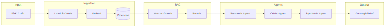
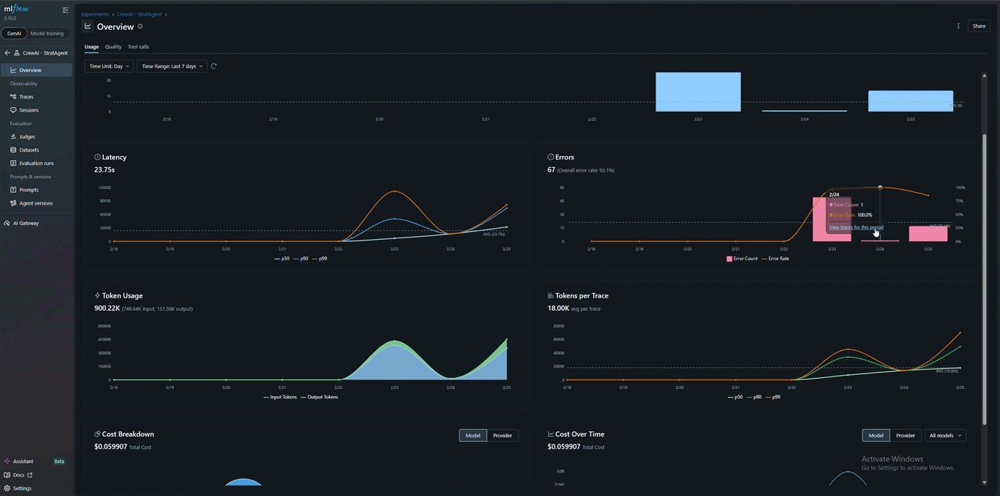
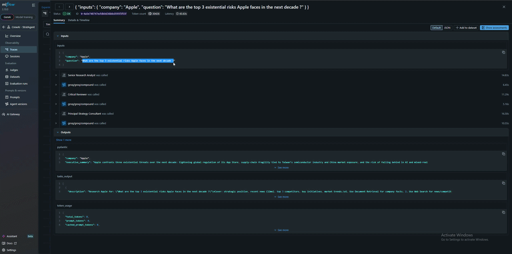

<h1>
  
  StratAgent
</h1>

**Multi-Agent RAG System for Strategic Business Analysis**

AI-powered research that cuts analyst deep-dives from hours to minutes. Upload documents, ask a question, get a structured StrategicBrief—executive summary, SWOT, risks, and recommendations—in under 15 minutes.


*Full analysis pipeline: upload documents, run analysis, receive StrategicBrief.*

---

## The Problem

Strategic analysts spend **~8 hours** per company deep-dive: gathering sources, synthesizing findings, building SWOT analyses, identifying risks, and drafting recommendations. Manual research is slow, inconsistent, and hard to scale across portfolios.

Worse, LLM-powered tools that could accelerate this work often cost **$200–500+ per month** in API fees—blocking adoption for teams without budget approval.

---

## The Solution

StratAgent automates the research → critique → synthesis pipeline with **3 specialized agents**:

1. **Research Agent** — Retrieves relevant documents (RAG) and searches the web for context
2. **Critic Agent** — Reviews findings for gaps, weak claims, and counterarguments
3. **Synthesis Agent** — Produces a structured **StrategicBrief** (executive summary, SWOT, risks, recommendations, caveats)

**Low-cost by design.** StratAgent runs on **Gemini free tier** (embeddings), **Groq free tier** (LLM), and **HuggingFace** (reranking)—no paid LLM APIs required. This is the power: most LLM applications are cost-intensive; StratAgent is built for teams that need impact without the bill.

**Full observability.** Every run is tracked in **MLflow**: tokens, costs, agent behavior, tool calls. Governance and optimization built in.

---

## Architecture



- **Ingestion**: Documents are chunked, embedded (Pinecone-hosted embeddings), and stored in Pinecone
- **RAG**: Two-stage retrieval—vector similarity search, then cross-encoder reranking (BAAI/bge-reranker-v2-m3) for precision
- **Agents**: CrewAI orchestrates Research → Critic → Synthesis with structured outputs

---

## Key Technical Decisions & Business Impact

| Decision | Why | Business Impact |
|----------|-----|-----------------|
| **Groq + Gemini free tier** | Zero LLM cost; fast inference | Enables pilot and small-team use without budget approval |
| **HuggingFace reranker** (BAAI/bge-reranker-v2-m3) | Local reranking, no API cost | Improves retrieval precision; reduces irrelevant context |
| **Two-stage RAG** (vector + rerank) | Balance recall vs. precision | Higher-quality briefs; fewer hallucinations |
| **CrewAI multi-agent** | Clear separation of research, critique, synthesis | Structured output; audit trail per phase |
| **Pinecone** | Managed vector DB | No ops overhead; scales with document volume |
| **MLflow autolog** | CrewAI integration | Full traceability: tokens, costs, tool calls, agent behavior |

**Quantified impact:**

- Reduces analyst research time from **~8 hours to ~15 minutes** per company
- **$0/month** LLM cost on free tiers (vs. $200–500+ for GPT-4/Claude)
- Every run tracked in MLflow: token usage, costs, and agent behavior for governance

---

## Setup Guide

### Prerequisites

- Python 3.13
- [uv](https://docs.astral.sh/uv/) (or pip)

### Quick Start (Local)

```bash
# Clone and install
git clone https://github.com/YOUR_USERNAME/stratagent.git
cd stratagent
uv sync --all-extras   # or: pip install -e .

# Configure environment
# Create .env in project root with:
# GROQ_API_KEY=your_groq_key
# PINECONE_API_KEY=your_pinecone_key
# GEMINI_API_KEY=your_gemini_key
# TAVILY_API_KEY=your_tavily_key
# PINECONE_INDEX_NAME=stratagent

# Run API (terminal 1)
stratagent-api         # or: uv run uvicorn api.main:app --reload

# Run frontend (terminal 2)
streamlit run frontend/app.py --server.port=8501

# Optional: MLflow UI (terminal 3, for observability)
mlflow ui --backend-store-uri sqlite:///mlflow.db
```

- **API**: http://localhost:8000 (docs at `/docs`)
- **Frontend**: http://localhost:8501
- **MLflow**: http://localhost:5000 (when running)

### Docker

```bash
docker compose -f infra/docker/docker-compose.yml up
```

- **API**: http://localhost:8000
- **Frontend**: http://localhost:8501

### Required Environment Variables

| Variable | Purpose |
|----------|---------|
| `GROQ_API_KEY` | LLM (CrewAI agents) |
| `PINECONE_API_KEY` | Vector store |
| `GEMINI_API_KEY` | Embeddings (CrewAI memory) |
| `TAVILY_API_KEY` | Web search |
| `PINECONE_INDEX_NAME` | Index name (default: stratagent) |

### Ingestion

Ingest documents via API:

- **Upload PDFs**: `POST /ingest/upload` (multipart form)
- **Ingest URL**: `POST /ingest/url` (JSON body: `{"url": "https://..."}`)

Then run analysis: `POST /analysis/analyze` or `POST /analysis/analyze-test` (sync).

---

## Demo

### StratAgent in Action


*Upload documents, run analysis, receive StrategicBrief.*

### Observability (MLflow)

| Token usage & costs | Agent behavior & tool calls |
|---------------------|----------------------------|
|  |  |

Everything is tracked: tokens, costs, agent behavior, tool calling. Run `mlflow ui` to inspect runs.

---

## Future Roadmap

- **Phase 1**: Multi-company batch analysis; PDF export of StrategicBrief
- **Phase 2**: Custom agent roles; pluggable LLM backends (OpenAI, Anthropic)
- **Phase 3**: Enterprise SSO; team workspaces; audit logs

---

## License

MIT
